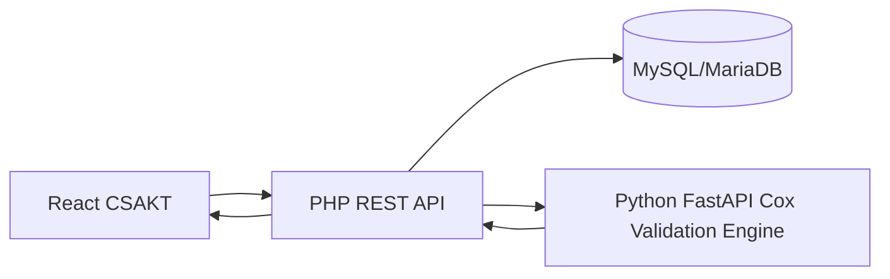

# CSAKT

CSAKT adalah aplikasi web untuk analitik kausal dan survival pada penurunan kelaikan terbang penerbang berbasis integrasi data MCU, psikotes, dan jam terbang.

## Stack

- Frontend: React, Vite, TypeScript strict, Tailwind CSS, shadcn/Radix-style components, React Router, TanStack Query/Table, React Hook Form, Zod, Zustand, Recharts, Axios.
- Backend: PHP native REST JSON, mysqli, prepared statements, MySQL/MariaDB.

## Menjalankan frontend

```bash
npm install
npm run dev
```

## Backend PHP

1. Buat database dengan `backend/database/schema.sql`.
2. Isi data awal dengan `backend/database/seed.sql`.
3. Jalankan server PHP dari root proyek:

```bash
php -S 127.0.0.1:8080 -t .
```

Set `VITE_API_BASE_URL=http://127.0.0.1:8080/backend/api` bila ingin menghubungkan frontend ke backend PHP.

## Import Cerdas

Route frontend:

- `/import`: wizard Upload -> Preview Mentah -> Auto-Mapping -> Validasi & Commit.
- `/import/history`: audit trail import.

Endpoint backend:

- `POST /backend/api/import/upload`
- `GET /backend/api/import/{import_id}/preview`
- `POST /backend/api/import/{import_id}/mapping`
- `POST /backend/api/import/{import_id}/validate`
- `POST /backend/api/import/{import_id}/commit`
- `GET /backend/api/import/{import_id}/errors.csv`
- `GET /backend/api/import/history`
- `GET|POST /backend/api/import/mapping-template`

Library parser file:

```bash
composer install
```

Sinonim utama yang sudah dikenali:

- MCU: `Tgl MCU`, `Tanggal Pemeriksaan`, `tgl_periksa`, `TD`, `tensi`, `Kolestrol`, `BMI`, `IMT`.
- Psikotes: `stress index`, `stres`, `atensi`, `stabilitas emosi`, `rekomendasi`.
- Jam terbang: `jenis pswt`, `jam total`, `misi mlm`, `flight hour`, `mission`.
- Penerbang: `NRP`, `Nama`, `Pangkat`, `Satuan`, `Skadron`, `Jenis Pesawat`.

Aturan normalisasi nilai berada di `backend/services/ImportNormalizer.php`. Tambahkan field baru dengan memperluas `normalizeValue()` dan `validateValue()`.

Sampel demo tersedia di `/samples`:

- `mcu_messy_2016_2026.xlsx`: workbook MCU dengan merged cells, header typo, subtotal, catatan kaki, nilai satuan, dan baris error.
- `logbook_campuran.xlsx`: workbook logbook multi-sheet dengan header singkatan dan nilai jam tidak konsisten.
- `catatan_psikologi_naratif.docx`: dokumen psikotes berisi paragraf naratif dan tabel Word kecil.

Tahap implementasi import:

1. Upload dan validasi tipe/ukuran file.
2. Parse XLS/XLSX/DOCX dengan PhpSpreadsheet/PhpWord bila `composer install` sudah dijalankan.
3. Auto-detect entitas dengan fuzzy matching sinonim header.
4. Mapping kolom sumber ke field target dengan confidence score.
5. Normalisasi tanggal, angka+satuan, tekanan darah, enum status, dan NRP.
6. Validasi baris, simpan error report, dan commit baris valid dalam transaksi.

## Modul Validasi Statistik Cox

Route frontend:

- `/analitik/validasi`: dashboard validasi metodologis Cox dengan tab PH, missing data, EPV/VIF, diskriminasi/kalibrasi, bootstrap, dan residual.
- `/analitik/validasi/history`: riwayat run validasi.

Endpoint backend PHP:

- `POST /backend/api/validasi/run`
- `GET /backend/api/validasi/{job_id}`
- `GET /backend/api/validasi/history`
- `GET /backend/api/validasi/{job_id}/export`

Engine statistik terdistribusi:

```bash
cd engine
pip install -r requirements.txt
uvicorn main:app --host 127.0.0.1 --port 8091
```

## Arsitektur AI Terdistribusi

Route frontend:

- `/sistem/terdistribusi`: observability gateway PHP, broker Redis, coordinator, worker Python, job/subtask, retry, benchmark speedup, dan federated aggregation.

Endpoint backend PHP:

- `POST /backend/api/jobs`
- `GET /backend/api/jobs/{job_id}`
- `GET /backend/api/jobs/{job_id}/result`
- `GET /backend/api/cluster/status`

Cluster lokal penuh:

```bash
docker compose up --build
```

Komponen yang dijalankan Compose:

- `frontend-dashboard`: SPA React/Vite pada port `5174`.
- `gateway`: PHP native + mysqli + Redis extension pada port `8080`.
- `mysql`: MariaDB dengan schema dan seed CSAKT.
- `redis`: broker queue untuk `csakt:jobs`, `csakt:subtasks`, `csakt:results`, `csakt:deadletter`.
- `validation-engine`: FastAPI Cox validation engine pada port `8091`.
- `coordinator`: splitter/reducer job bootstrap Cox.
- `worker-1` sampai `worker-4`: competing consumers untuk subtask bootstrap.

Uji cepat job terdistribusi:

```bash
curl -X POST http://127.0.0.1:8080/backend/api/jobs \
  -H "Content-Type: application/json" \
  -d "{\"type\":\"bootstrap_validation\",\"bootstraps\":1000,\"chunk_size\":100}"
```

Detail arsitektur, diagram, fault tolerance, dan federated aggregation ada di `docs/distributed-architecture.md`.

Skrip demo:

```powershell
./scripts/demo-distributed-bootstrap.ps1
./scripts/demo-distributed-federated.ps1
```

Arsitektur:



Ringkasan seed demo:

- Uji PH global Schoenfeld p = 0,118: global masih terpenuhi, tetapi `stress index` perlu sensitivitas time-varying.
- EPV = 7,5: kategori hati-hati; pertimbangkan penalized Cox atau reduksi kovariat.
- C-index = 0,78 (CI 95% 0,72-0,84): diskriminasi baik.
- Missing total = 6,8% dengan Little's MCAR p = 0,031: gunakan MICE sebagai pembanding complete-case.
