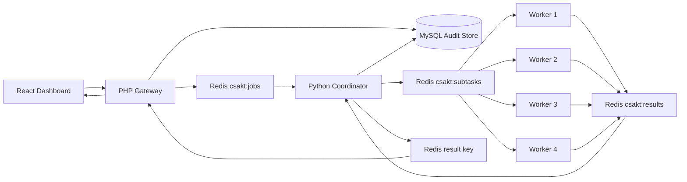

# Arsitektur AI Terdistribusi CSAKT

Dokumen ini menjelaskan artefak implementasi untuk bukti bahwa CSAKT tidak hanya menjalankan analitik pada satu proses, tetapi memiliki subsistem AI terdistribusi yang dapat diskalakan dan diuji.

## Komponen

- React dashboard: route `/sistem/terdistribusi` untuk observability cluster, job, subtask, retry, speedup, dan federated aggregation.
- PHP gateway: endpoint REST `/backend/api/jobs`, `/backend/api/jobs/{id}`, `/backend/api/jobs/{id}/result`, dan `/backend/api/cluster/status`.
- Redis broker: queue `csakt:jobs`, `csakt:subtasks`, `csakt:results`, dan `csakt:deadletter`.
- Coordinator Python: membagi bootstrap Cox menjadi chunk, mengirim subtask ke queue, lalu melakukan reduce hasil.
- Worker Python: competing consumers yang mengambil subtask, menjalankan simulasi bootstrap Cox, mengirim partial result, heartbeat, dan retry saat gagal.
- MySQL/MariaDB: tabel `jobs`, `subtasks`, dan `workers` menyimpan audit trail.
- Validation engine: FastAPI mock/statistical service untuk validasi Cox metodologis.

## Alur Job



## Menjalankan Cluster

```bash
docker compose up --build
```

Alamat layanan:

- Frontend: `http://127.0.0.1:5174`
- PHP gateway: `http://127.0.0.1:8080/backend/api`
- Python validation engine: `http://127.0.0.1:8091`
- MySQL host port: `3307`
- Redis host port: `6379`

## Uji Manual

Kirim job bootstrap:

```bash
curl -X POST http://127.0.0.1:8080/backend/api/jobs \
  -H "Content-Type: application/json" \
  -d "{\"type\":\"bootstrap_validation\",\"bootstraps\":1000,\"chunk_size\":100}"
```

Pantau cluster:

```bash
curl http://127.0.0.1:8080/backend/api/cluster/status
```

Lihat benchmark simulasi:

```bash
python distributed/benchmark.py
```

Jalankan demo bootstrap dan federated aggregation:

```powershell
./scripts/demo-distributed-bootstrap.ps1
./scripts/demo-distributed-federated.ps1
```

## Fault Tolerance

Worker mengembalikan subtask ke queue bila terjadi exception. Field `attempt` dinaikkan sampai `CSAKT_MAX_ATTEMPTS`. Setelah melewati ambang, payload dipindahkan ke `csakt:deadletter` agar coordinator dan dashboard dapat menampilkan subtask bermasalah tanpa menggagalkan seluruh cluster secara diam-diam.

## Federated Aggregation

Mode federated ditampilkan di dashboard sebagai simulasi multi-satuan. Setiap node skadron mengirim sufficient statistics seperti `X'X`, `X'y`, dan `event_count`; raw data MCU/psikotes/logbook tetap berada di node lokal. Pola ini cocok untuk data medis-operasional yang sensitif.

Implementasi queue federated ada pada `distributed/coordinator.py` dan `distributed/worker.py`: coordinator membuat subtask `federated_stats` per node, worker mengembalikan agregat lokal, lalu coordinator menjumlahkan matriks/vector sufficient statistics menjadi `global_sufficient_stats`.
