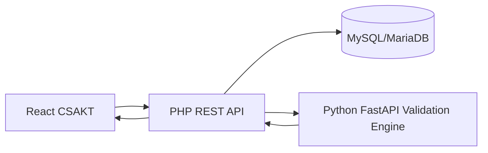

# CSAKT Cox Validation Engine

Engine ini adalah node statistik terpisah dari backend PHP. PHP mengambil data dari MySQL/MariaDB, mengirim JSON ke engine, menyimpan hasil validasi, lalu frontend menggambar chart secara interaktif.



## Menjalankan

```bash
cd engine
python -m venv .venv
.venv\Scripts\activate
pip install -r requirements.txt
uvicorn main:app --host 127.0.0.1 --port 8091
```

Set backend:

```env
VALIDATION_ENGINE_URL=http://127.0.0.1:8091
```

## Endpoint

- `POST /engine/cox/fit`
- `POST /engine/cox/ph-test`
- `POST /engine/missing/analyze`
- `POST /engine/validate/bootstrap`
- `POST /engine/residuals`

Output selalu berupa JSON angka dan array titik chart. Server tidak merender gambar.

## Catatan Implementasi Statistik

Versi scaffold mengembalikan hasil deterministik untuk demo. Untuk produksi, isi endpoint dengan:

- `lifelines.CoxPHFitter` untuk fit Cox, HR, CI, p-value, dan Schoenfeld residual.
- `lifelines.statistics.proportional_hazard_test` untuk uji PH.
- `statsmodels` atau paket imputasi MICE untuk missing data.
- `scikit-survival` untuk time-dependent AUC dan Brier score.
- Bootstrap resampling 500-1000 iterasi untuk optimism-corrected C-index dan calibration slope.
